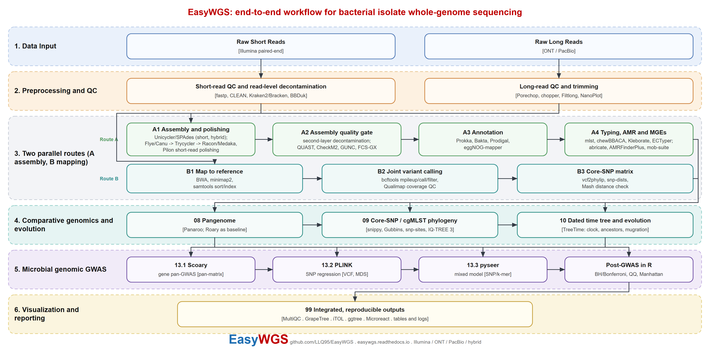

# EasyWGS

[English](README.md) | **简体中文**

EasyWGS 是一套面向细菌分离株全基因组测序（WGS）的可复现流程，按编号目录组织。它同时
覆盖二代 Illumina、三代 Oxford Nanopore / PacBio 与混合组装，串联质控、双层去污染、组装与
打磨、组装评估、注释、MLST、分物种血清型、cgMLST、耐药/毒力/可移动元件扫描、泛基因组、核心
SNP 系统发育与 TreeTime 时间树。组织方式参考 EasyMicrobiome、EasyMetagenome 的教学化风格：
改每个编号脚本顶部参数，按顺序执行即可。

完整图文教程：https://easywgs.readthedocs.io （英文为默认版本，可切换简体中文）。



上图展示质控与双层去污染之后的两条并行路线：组装路线（模块 03–09）与参考比对路线（模块 12），
二者汇合于系统发育与 TreeTime 时间树，另设基因组 GWAS/post-GWAS 层（模块 13），并共用可视化（11）
与结果汇总（99）。可编辑 SVG、可直接投稿的 PDF 与生成脚本位于 [`figures/`](figures/)。

## 按测序平台划分的分析主线

流程提供两条并行主路线，共用同一套质控与汇总层：组装路线（`run_assembly.sh`）
de novo 重建基因组，并从 contig 得到基因内容、泛基因组与核心 SNP 系统发育；参考比对
路线（`run_mapping.sh`）把 reads 比对到一株近缘完整参考，生成 BAM/VCF，再做微生物 GWAS。
`run_all.sh` 会同时运行两条路线，详见指南页“两条并行策略”。

```text
二代 Illumina 双端
  01 质控(fastp) -> 02 reads去污染(CLEAN) -> 03 Unicycler(SPAdes备选) -> 04 质检门控 -> …
三代 ONT / PacBio
  01b 长读质控(porechop + NanoPlot + Filtlong) -> 03 Flye -> Racon -> Medaka(可选Trycycler) -> …
混合 hybrid
  01 + 01b -> 02(清洁短读) -> 03 Unicycler --mode bold / SPAdes hybrid + Pilon -> …

04  QUAST + CheckM2 + GUNC +(可选)FCS-GX 组装层去污染门控
04.5 FastANI 全基因组 ANI 物种确认（用于混合多物种面板）
05  Prokka/Bakta、Prodigal、eggNOG(GO/KEGG/COG)
06  6.1 MLST；6.2 分物种血清型；6.3 chewBBACA cgMLST；6.4 自定义毒素/表面位点筛查
07  abricate多库 + AMRFinder/RGI/PointFinder + geNomad/Mob-suite/IntegronFinder
08  Panaroo(备选 Roary)泛基因组
09  snippy -> Gubbins -> IQ-TREE -> snp-dists 核心SNP系统发育
10  TreeTime 时钟筛选、时间树、祖先重建、同源突变、状态迁移
12  并行参考比对路线：BWA/minimap2 -> 排序建索引 BAM -> bcftools VCF 与 SNP 矩阵
13  微生物 GWAS：Scoary(泛基因组基因)、PLINK(SNP)、pyseer(距离核混合模型)，
    再由 R 完成 BH/Bonferroni 校正、QQ 图与曼哈顿图
11  可视化：合并元数据、ggtree 树图、GrapeTree 最小生成树、iTOL 注释、热图与在线交互包
99  汇总主表（供 11 可视化调用）
```

## 快速开始

```bash
bash 00_install/install_env.sh      # 创建 conda 环境（含独立 longread 长读环境）
bash 00_install/download_db.sh      # 数据库仅下载一次
cp config/samplesheet.csv config/my_samples.csv   # 改路径、platform 与 species
bash run_all.sh config/my_samples.csv             # 两条路线与全部模块一起运行
bash run_assembly.sh config/my_samples.csv        # 只跑组装路线
TRAIT=MDR bash run_mapping.sh config/my_samples.csv   # 只跑参考比对与 GWAS
bash run_all.sh config/my_samples.csv 06          # 或从指定步骤恢复
```

样本表 `platform` 取 illumina / nanopore / pacbio / hybrid，决定组装路线；`species` 取
kpsc / ecoli / salm / listeria / vibrio / yersinia / campylobacter / burkholderia /
clostridium / saureus / cronobacter / cholerae / anthracis / cereus / mallei /
mtuberculosis / brucella / other，决定分型调度。最终组装统一为
`03_assembly/genomes/{id}.fasta`（已去除 200 nt 以下短片段），供后续所有模块读取。

## 多病原公共数据实战示例

[`examples/`](examples/) 用真实、accession 已核实的公开分离株端到端跑通整个流程，覆盖
19 类病原（tier 1-4 的十类，加上金黄色葡萄球菌、阪崎克罗诺杆菌、痢疾志贺菌、霍乱弧菌、
炭疽杆菌、蜡样芽胞杆菌、鼻疽伯克霍尔德菌、结核分枝杆菌、羊种布鲁菌），包含一个 12 株的沙门菌
时间序列集合、5 株 Illumina/Nanopore 严格配对的 hybrid 样本，以及 14 类专化病原，并组织为
10、20、29、44、71 五个嵌套 tier。tier 4 新增 FastANI 物种确认门控（模块 04.5）与自定义
毒素/表面位点筛查（模块 06.4）；tier 5 把二者扩展到九类新病原，并为结核和蜡样群提供专门的谱系
判定工具，比较类模块按单物种子集运行。读段按需从 ENA/NCBI 下载并下采样，普通服务器即可运行；预期结果检查器输出
PASS/WARN/FAIL，受控的 PhiX 与近缘菌 spike-in 实验用于验证两层去污染。

```bash
EXAMPLE_PAIRS=800000 bash examples/00_download_panel.sh 1   # 下载 tier 1 与参考基因组
bash examples/01_run_panel.sh 1                             # 端到端运行全部模块
bash examples/02_run_spikein.sh                             # 去污染验证（图 4）
```

面板 accession、输出文件与集合级分析见 [`examples/README.md`](examples/README.md) 以及
双语指南页面[实战示例（公共数据面板）](https://easywgs.readthedocs.io/en/latest/zh/example-walkthrough/)。

## 分物种分型调度（06 模块）

| 类群 | 7基因 MLST | 血清型/表面抗原 | cgMLST schema |
| --- | --- | --- | --- |
| 肺克复合群 kpsc | mlst | Kleborate(集成 Kaptive，K/O 抗原) | INNUENDO 或自建 |
| 大肠/志贺 ecoli | mlst | ECTyper(O:H)+ShigEiFinder(志贺/EIEC) | EnteroBase 大肠/志贺 |
| 沙门 salm | mlst | SeqSero2+SISTR | INNUENDO cgMLST99 |
| 李斯特 listeria | mlst | 分子血清群(走 cgMLST) | Pasteur cgMLST |
| 副溶 vibrio | mlst(弧菌) | 06.4 tlh/tdh/trh/orf8、T3SS2 与 O/K 位点 | PubMLST 经 PrepExternalSchema |
| 耶尔森 yersinia | mlst(耶尔森菌) | 06.4 ail/yst、pYV yadA/virF | PrepExternalSchema |
| 空弯/结弯 campylobacter | mlst(弯曲菌) | 06.4 cdt/cadF/flaA 与荚膜位点 | PubMLST jejuni-coli |
| 唐菖蒲 burkholderia | 无；FastANI 确认 | 06.4 米酵菌酸 bon 与毒黄素 tox 簇 | PrepExternalSchema |
| 肉毒 clostridium | mlst(肉毒梭菌) | 06.4 bont/ntnh；MOB-suite 判定位点 | PrepExternalSchema |
| 金葡 saureus | mlst(金葡) | 06.4 nuc/mecA/PVL/tst；可选 spaTyper、SCCmecFinder | PubMLST 金葡 |
| 阪崎克罗诺 cronobacter | mlst(克罗诺属) | 06.4 ompA/zpx/cpa；PubMLST O 抗原 | PrepExternalSchema |
| 痢疾志贺 dysenteriae | mlst(大肠) | ECTyper+ShigEiFinder；06.4 ipaH/stxA/virF | EnteroBase 大肠/志贺 |
| 霍乱 cholerae | mlst(霍乱弧菌) | 06.4 ompW/ctx/tcpA 与 O1/O139 位点 | PubMLST 弧菌 |
| 炭疽 anthracis | mlst(蜡样群) | 06.4 pXO1 pag/cya/lef 与 pXO2 cap；可选 BTyper3 | PrepExternalSchema |
| 蜡样 cereus | mlst(蜡样群) | 06.4 nhe/hbl/cytK/ces；可选 BTyper3 panC | PrepExternalSchema |
| 鼻疽 mallei | mlst(类鼻疽群) | 06.4 bimA/bsa；物种区分靠 curated SNP 树 | PrepExternalSchema |
| 结核 mtuberculosis | 无；FastANI 确认 | 比对 H37Rv 后 TB-Profiler/Mykrobe；06.4 esx 仅辅助 | 谱系判定工具 |
| 羊种布鲁 brucella | 无；FastANI 确认 | 06.4 bcsp31/IS711/omp2b/wbkA；外部 cgMLST/MLVA | 布鲁菌 cgMLST |
| other | mlst 自动识别 | 按需扩展 | PrepExternalSchema |

## WGS 工具清单

平台列：S 以二代短读为主，L 以三代长读为主，A 对二者或组装结果通用。每条链接均已对照上游
仓库或官方网站核验，按分析阶段分类，即本流程使用或推荐的工具。各工具当前上游版本与核验
日期见 guidebook 的[软件版本](https://easywgs.readthedocs.io/zh/latest/versions/)页。
除下列默认工具外，[工具百科](https://easywgs.readthedocs.io/zh/latest/alternative-tools/)按阶段补充仍在活跃维护的
备选工具，以及出现较早、如今多有继任者但仍可运行的经典旧代工具，并标注被谁替代
（如 Trimmomatic→fastp、CheckM→CheckM2、Prokka→Bakta、Roary→Panaroo、SEER→pyseer）；
机读主数据表为 `reference/tool_catalog.tsv`。指南还在
[超越细菌：病毒、真菌与益生菌](https://easywgs.readthedocs.io/en/latest/zh/extensibility/)中评估了同一设计向细菌之外的迁移，
给出共用与类群特异工具的韦恩图，以及病毒（HIV、SARS-CoV-2、诺如病毒）、致病真菌（曲霉、念珠菌）
与益生菌安全评价的配置（百科第 26–31 阶段）。

### 质控与读段处理

| 工具 | 平台 | 说明 | 来源 |
| --- | --- | --- | --- |
| fastp | S/L | 去接头、质量过滤与质控报告 | [GitHub](https://github.com/OpenGene/fastp) |
| FastQC | S | 单文件读段质量报告 | [GitHub](https://github.com/s-andrews/FastQC) |
| MultiQC | A | 跨批次汇总质控报告 | [GitHub](https://github.com/MultiQC/MultiQC) |
| seqkit | A | fasta/fastq 处理、统计与抽样 | [GitHub](https://github.com/shenwei356/seqkit) |
| Porechop | L | 长读去接头与条形码 | [GitHub](https://github.com/rrwick/Porechop) |
| chopper | L | 长读按长度/质量过滤 | [GitHub](https://github.com/wdecoster/chopper) |
| NanoPlot | L | 长读长度与质量分布图 | [GitHub](https://github.com/wdecoster/NanoPlot) |
| Filtlong | L | 按质量加权保留长读 | [GitHub](https://github.com/rrwick/Filtlong) |

### 去污染与物种筛查

| 工具 | 平台 | 说明 | 来源 |
| --- | --- | --- | --- |
| Kraken2 | S | k-mer 物种分类与污染侦察 | [GitHub](https://github.com/DerrickWood/kraken2) |
| Bracken | S | 校正 Kraken2 丰度估计 | [GitHub](https://github.com/jenniferlu717/Bracken) |
| CLEAN | S/L/A | reads/组装层按目标类群保留去污染 | [GitHub](https://github.com/rki-mf1/clean) |
| BBMap / BBDuk | S | 参考序列/接头/PhiX 剔除 | [GitHub](https://github.com/BioInfoTools/BBMap) |
| CheckM2 | A | 组装完整度与污染率 | [GitHub](https://github.com/chklovski/CheckM2) |
| GUNC | A | 嵌合（混种）基因组检测 | [GitHub](https://github.com/grp-bork/gunc) |
| FCS / FCS-GX | A | NCBI 外源污染筛查与净化 | [GitHub](https://github.com/ncbi/fcs) |
| BlobToolKit | A | contig 级分类/覆盖度交互式质控 | [GitHub](https://github.com/genomehubs/blobtoolkit) |

### 组装与打磨

| 工具 | 平台 | 说明 | 来源 |
| --- | --- | --- | --- |
| SPAdes | S/混合 | 短读与混合 de Bruijn 组装器 | [GitHub](https://github.com/ablab/spades) |
| Unicycler | S/混合 | 单菌组装器，bold 混合模式，利于成环 | [GitHub](https://github.com/rrwick/Unicycler) |
| Flye | L | 长读组装器并标注环状 contig | [GitHub](https://github.com/mikolmogorov/Flye) |
| Canu | L | 保守型长读组装器 | [GitHub](https://github.com/marbl/canu) |
| Dragonflye | L | 面向 Nanopore 的 SPAdes 式流水线 | [GitHub](https://github.com/rpetit3/dragonflye) |
| Trycycler | L | 多组装一致，完成图金标准 | [GitHub](https://github.com/rrwick/Trycycler) |
| minimap2 | L/A | 通用长读比对、读段对组装比对 | [GitHub](https://github.com/lh3/minimap2) |
| Racon | L | 长读一致性校正（限制轮数） | [GitHub](https://github.com/lbcb-sci/racon) |
| Medaka | L | ONT 神经网络一致性抛光 | [GitHub](https://github.com/nanoporetech/medaka) |
| Pilon | S/混合 | 短读碱基级纠错回填 | [GitHub](https://github.com/broadinstitute/pilon) |
| Circlator | A | 组装成环与起点固定 | [GitHub](https://github.com/sanger-pathogens/circlator) |

### 组装统计、距离与去冗余

| 工具 | 平台 | 说明 | 来源 |
| --- | --- | --- | --- |
| QUAST | A | 组装统计（N50、contig 数、错拼） | [GitHub](https://github.com/ablab/quast) |
| Mash | A | 快速基因组距离与聚类 | [GitHub](https://github.com/marbl/Mash) |
| cd-hit | A | 相似序列聚类/去冗余 | [GitHub](https://github.com/weizhongli/cdhit) |
| MUMmer | A | 全基因组比对与共线性 | [GitHub](https://github.com/mummer4/mummer) |
| FastANI | A | 全基因组 ANI 物种确认（模块 04.5） | [GitHub](https://github.com/ParBLiSS/FastANI) |

### 结构与功能注释

| 工具 | 平台 | 说明 | 来源 |
| --- | --- | --- | --- |
| Prokka | A | 快速原核基因组注释 | [GitHub](https://github.com/tseemann/prokka) |
| Bakta | A | 标准化注释、数据库更新及时 | [GitHub](https://github.com/oschwengers/bakta) |
| Prodigal | A | 原核基因（蛋白）预测 | [GitHub](https://github.com/hyattpd/Prodigal) |
| eggNOG-mapper | A | GO/KEGG/COG 功能注释 | [GitHub](https://github.com/jhcepas/eggnog-mapper) |

### 分型：MLST、血清型与 cgMLST

| 工具 | 平台 | 说明 | 来源 |
| --- | --- | --- | --- |
| mlst | A | 扫描 PubMLST 七基因序列型 | [GitHub](https://github.com/tseemann/mlst) |
| Kleborate | A | 肺克 ST、K/O 抗原、耐药与毒力 | [GitHub](https://github.com/klebgenomics/Kleborate) |
| ECTyper | A | 大肠埃希菌 O:H 血清型 | [GitHub](https://github.com/phac-nml/ecoli_serotyping) |
| ShigEiFinder | A | 志贺/肠侵袭性大肠区分 | [GitHub](https://github.com/LanLab/ShigEiFinder) |
| SeqSero2 | A | 读段或组装推沙门抗原公式 | [GitHub](https://github.com/denglab/SeqSero2) |
| SISTR | A | 沙门血清变种，内含 cgMLST | [GitHub](https://github.com/phac-nml/sistr_cmd) |
| chewBBACA | A | cgMLST 建库、等位调用与评估 | [GitHub](https://github.com/B-UMMI/chewBBACA) |
| spaTyper / SCCmecFinder | A | 金葡 spa 重复型与 SCCmec 盒分型（可选） | [CGE 官网](https://www.genomicepidemiology.org/) |
| BTyper3 | A | 蜡样群 panC 群与毒力分型（可选） | [GitHub](https://github.com/lmc297/BTyper3) |
| TB-Profiler | A | 结核谱系与耐药判定（可选） | [GitHub](https://github.com/jodyphelan/TBProfiler) |
| Mykrobe | A | 结核与金葡的快速 k-mer 耐药判定（可选） | [GitHub](https://github.com/Mykrobe-tools/mykrobe) |

### 耐药、毒力与可移动元件

| 工具 | 平台 | 说明 | 来源 |
| --- | --- | --- | --- |
| abricate | A | 一次扫描多个耐药/毒力数据库 | [GitHub](https://github.com/tseemann/abricate) |
| AMRFinderPlus | A | NCBI 耐药基因注释 | [GitHub](https://github.com/ncbi/amr) |
| RGI (CARD) | A | CARD 耐药基因/等位注释 | [GitHub](https://github.com/arpcard/rgi) |
| ResFinder / PointFinder | A | 获得性耐药基因与染色体点突变 | [CGE 官网](https://www.genomicepidemiology.org/) |
| mob-suite | A | 质粒复制子、松弛酶、迁移与分型 | [GitHub](https://github.com/phac-nml/mob-suite) |
| PlasFlow | A | 染色体/质粒序列分类 | [GitHub](https://github.com/smaegol/PlasFlow) |
| mobileOG-db | A | 可移动元件蛋白同源数据库 | [GitHub](https://github.com/clb21565/mobileOG-db) |
| MGEfinder | A | 从分离株发现可移动遗传元件 | [GitHub](https://github.com/bhattlab/MGEfinder) |
| IntegronFinder | A | 整合子与基因盒识别 | [GitHub](https://github.com/gem-pasteur/Integron_Finder) |
| geNomad | A | 病毒与质粒/可移动元件识别 | [GitHub](https://github.com/apcamargo/genomad) |
| IslandPath-DIMOB | A | 基因组岛预测 | [GitHub](https://github.com/brinkmanlab/islandpath) |
| VirSorter2 | A | 前噬菌体/病毒序列检测 | [GitHub](https://github.com/simroux/VirSorter2) |
| PhiSpy | A | 前噬菌体边界预测 | [GitHub](https://github.com/linsalrob/PhiSpy) |
| CRISPRCasFinder | A | CRISPR 阵列与 cas 系统 | [官方网站](https://crisprcas.i2bc.paris-saclay.fr) |

### 参考比对与变异检测（参考路线，模块 12）

| 工具 | 平台 | 说明 | 来源 |
| --- | --- | --- | --- |
| BWA | S | BWA-MEM 短读比对到共用参考 | [GitHub](https://github.com/lh3/bwa) |
| samtools | A | BAM 排序/建索引、flagstat、深度与 pileup | [GitHub](https://github.com/samtools/samtools) |
| bcftools | A | 联合变异检测、归一化、过滤、VCF/基因型导出 | [GitHub](https://github.com/samtools/bcftools) |
| htslib（tabix/bgzip） | A | 压缩 VCF 建索引 | [GitHub](https://github.com/samtools/htslib) |
| Qualimap | A | 单 BAM 比对与覆盖度质控 | [GitHub](https://github.com/kokonech/QualiMap) |
| vcf2phylip | A | SNP VCF 转 FASTA/Phylip，构建参考路线 SNP 树 | [GitHub](https://github.com/edgardomortiz/vcf2phylip) |

### 微生物 GWAS 与 post-GWAS（模块 13）

| 工具 | 平台 | 说明 | 来源 |
| --- | --- | --- | --- |
| Scoary | A | 基于 Panaroo/Roary 矩阵的基因层 pan-GWAS（Fisher、成对比较、BH） | [GitHub](https://github.com/AdmiralenOla/Scoary) |
| PLINK | A | SNP 关联，IBS/MDS 控制群体结构 | [官网](https://www.cog-genomics.org/plink/) |
| pyseer | A | 微生物基因/SNP/k-mer GWAS，距离核混合模型 | [GitHub](https://github.com/mgalardini/pyseer) |

### 泛基因组、系统发育与分子定年

| 工具 | 平台 | 说明 | 来源 |
| --- | --- | --- | --- |
| Panaroo | A | 基于图的泛基因组聚类 | [GitHub](https://github.com/gtonkinhill/panaroo) |
| Roary | A | 经典泛基因组流水线 | [GitHub](https://github.com/sanger-pathogens/Roary) |
| snippy | A | 相对参考快速核心 SNP 调用 | [GitHub](https://github.com/tseemann/snippy) |
| Gubbins | A | 检测并屏蔽重组 | [GitHub](https://github.com/nickjcroucher/gubbins) |
| snp-sites | A | 从比对中提取变异 SNP 位点 | [GitHub](https://github.com/tseemann/snp-sites) |
| snp-dists | A | 两两 SNP 距离矩阵 | [GitHub](https://github.com/tseemann/snp-dists) |
| IQ-TREE 3 | A | 最大似然系统发育（仍兼容 IQ-TREE 2） | [GitHub](https://github.com/iqtree/iqtree3) |
| FastTree | A | 快速近似 ML 树，用于预览 | [官方网站](http://www.microbesonline.org/fasttree/) |
| MAFFT | A | 多序列比对 | [官方网站](https://mafft.cbrc.jp/alignment/software/) |
| TreeTime | A | 分子钟、时间树、祖先与状态迁移 | [GitHub](https://github.com/neherlab/treetime) |

### 可视化与交互探索

模块 11 在本地生成静态图，并为在线交互工具打包文件。平台列：A 表示对任意树、比对或矩阵通用。

| 工具 | 平台 | 说明 | 来源 |
| --- | --- | --- | --- |
| ggtree | A | R 中基于图形语法的系统发育树绘制 | [GitHub](https://github.com/YuLab-SMU/ggtree) |
| ggtreeExtra | A | 在树旁对齐注释层（色条、柱、分组框） | [GitHub](https://github.com/YuLab-SMU/ggtreeExtra) |
| treeio | A | 读写多种树格式（Newick、Nexus、BEAST） | [GitHub](https://github.com/YuLab-SMU/treeio) |
| ape | A | R 系统发育基础包，树读写、处理与统计 | [GitHub](https://github.com/emmanuelparadis/ape) |
| phangorn | A | R 系统发育估计与树操作 | [GitHub](https://github.com/KlausVigo/phangorn) |
| GrapeTree | A | 由 cgMLST 谱或核心比对构建最小生成树 | [GitHub](https://github.com/achtman-lab/GrapeTree) |
| pheatmap | A | SNP 距离与基因矩阵的聚类热图 | [GitHub](https://github.com/raivokolde/pheatmap) |
| ComplexHeatmap | A | 与树注释对齐的高级热图 | [GitHub](https://github.com/jokergoo/ComplexHeatmap) |
| ggplot2 | A | ggtree 底层使用的绘图语法 | [GitHub](https://github.com/tidyverse/ggplot2) |
| FigTree | A | 桌面端图形界面树查看与导出 | [GitHub](https://github.com/rambaut/figtree) |
| iTOL | A | 在线给树加色条与二元注释轨 | [官方网站](https://itol.embl.de) |
| Microreact | A | 在线交互式树+地图+时间轴 | [官方网站](https://microreact.org) |
| Phandango | A | 树与泛基因组、元数据的在线联动 | [官方网站](https://phandango.net) |
| icytree | A | 纯浏览器快速看树，无需账号 | [官方网站](https://icytree.org) |

### 数据获取与流程引擎

| 工具 | 平台 | 说明 | 来源 |
| --- | --- | --- | --- |
| NCBI datasets | A | 下载基因组、基因与元数据 | [GitHub](https://github.com/ncbi/datasets) |
| SRA toolkit | A | 获取并转换 SRA 数据 | [GitHub](https://github.com/ncbi/sra-tools) |
| Nextflow | A | 运行 CLEAN 所用的流程引擎 | [GitHub](https://github.com/nextflow-io/nextflow) |

### 超越细菌：病毒、真菌与益生菌

约一半流程（reads 质控、宿主去除、比对、变异检测、覆盖度、序列比对、极大似然树与报告）与类群无关。
[超越细菌](https://easywgs.readthedocs.io/en/latest/zh/extensibility/)指南页给出完整韦恩图、“阶段 × 类群”矩阵与分阶段扩展路线。
下表为代表性类群特异程序（收录于第 26–31 阶段）；共用程序（minimap2、bcftools、mosdepth、IQ-TREE 3 等）见上方各表。

| 工具 | 类群 | 说明 | 来源 |
| --- | --- | --- | --- |
| nf-core/viralrecon | 病毒 | 病毒 Illumina/ONT 参考流程模板 | [GitHub](https://github.com/nf-core/viralrecon) |
| iVar | 病毒 | 扩增子引物修剪与共识 | [GitHub](https://github.com/andersen-lab/ivar) |
| Nextclade / Pangolin | 病毒 | SARS-CoV-2 分支与谱系判定 | [GitHub](https://github.com/nextstrain/nextclade) |
| CheckV / VADR | 病毒 | 病毒完整度与参考引导注释 | [GitHub](https://github.com/chklovski/CheckV) |
| HAPHPIPE / V-pipe | 病毒 | HIV 宿主体内单倍型与准种 | [GitHub](https://github.com/gwcbi/haphpipe) |
| HIV-TRACE / HyPhy | 病毒 | TN93 传播簇与选择压力 | [GitHub](https://github.com/veg/hivtrace) |
| AAFTF | 真菌 | 单倍体真菌组装与打磨 | [GitHub](https://github.com/stajichlab/AAFTF) |
| BUSCO | 真菌 | 真核单拷贝直系同源完整度 | [GitLab](https://gitlab.com/ezlab/busco) |
| funannotate / BRAKER3 | 真菌 | 含内含子的真核基因注释 | [GitHub](https://github.com/nextgenusfs/funannotate) |
| ITSx / UNITE | 真菌 | ITS 条形码提取与参考库 | [UNITE](https://unite.ut.ee/) |
| OrthoFinder / GET_HOMOLOGUES | 真菌 | 基于直系同源群的比较基因组 | [GitHub](https://github.com/davidemms/OrthoFinder) |
| Control-FREEC | 真菌 | 拷贝数与非整倍体检测 | [GitHub](https://github.com/BoevaLab/FREEC) |
| antiSMASH / run_dbcan | 真菌 | 真菌次级代谢与 CAZyme | [GitHub](https://github.com/antismash/antismash) |
| EFSA QPS / FEEDAP | 益生菌 | 菌株安全框架（获得性耐药、产毒） | [EFSA](https://www.efsa.europa.eu/) |
| BAGEL4 / CRISPRCasFinder | 益生菌 | 细菌素、RiPP 与 CRISPR 有益证据 | [BAGEL4](http://bagel4.molgenrug.nl/) |

益生菌是叠加在细菌轨道上的安全与有益性配置（布拉氏酵母走真菌轨道），并非第四个生物学域。

## 硬件提示

本地运行 FCS-GX 需要约 470 GB 参考数据和约 512 GB 内存。普通服务器可保留 CheckM2 与
GUNC 门控，把 FCS-GX 放到 usegalaxy.org 在线运行。长读打磨工具（Medaka、Trycycler）单独放在
longread conda 环境，避免依赖冲突。

## 仓库结构

编号目录存放可执行脚本，其中 `run_assembly.sh` 与 `run_mapping.sh` 是两条并行主路线的
驱动脚本（分别为 de novo 组装路线、参考 BAM/VCF 比对路线，后者再由模块 13 拓展微生物 GWAS），
`11_visualization` 负责生成 R 静态图并打包 iTOL/Microreact/Phandango/GrapeTree 的上传文件；
`docs/` 为中英双语 MkDocs Material 教程源，`.github/workflows/` 负责文档自动构建。本流程整合
LLQ95/Practical-Encyclopedia-of-Whole-Genome-Analysis 的实操经验，补入双层去污染门控、分物种
血清型、完整三代打磨链、TreeTime 闭环、透明的参考比对与变异检测路线、带 post-GWAS 作图的微生物
GWAS，以及统一的下游可视化层。

## 贡献、许可与引用

见 [CONTRIBUTING.md](CONTRIBUTING.md) 与 [CHANGELOG.md](CHANGELOG.md)，采用 MIT 许可，引用信息在
[CITATION.cff](CITATION.cff)。新增工具时请同步更新编号脚本、安装脚本与本工具清单，并保持英文与
中文两个 README 一致。
