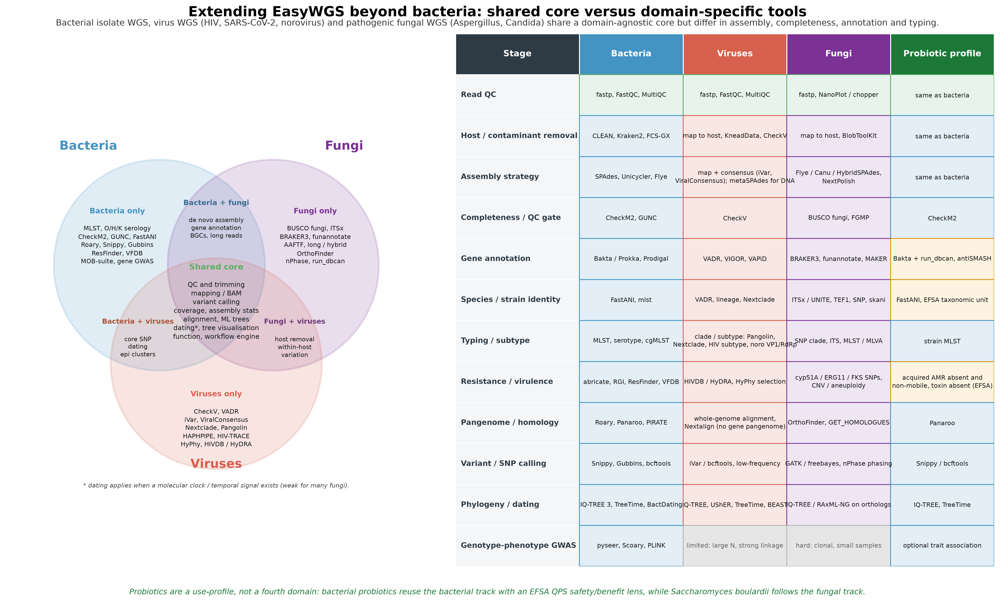

# 超越细菌：病毒、致病真菌与益生菌

EasyWGS 的编号模块最初围绕细菌分离株设计，但当研究对象换成病毒、致病真菌或益生菌时，许多步骤其实是重复的。本页评估现有设计能在多大程度上迁移、哪些软件可以共用、哪些是某一类群特有的，并说明如何在不把单一脚本强加给基因组生物学差异很大的生物的前提下扩展项目。简短的结论是：由于大约一半流程与类群无关，这套架构具有良好的可迁移性；但组装策略、完整度模型、注释引擎和分型范式差异明显，为所有生物套用同一个 `run_all.sh` 会产生误导。可维护的做法是“共享核心 + 轻量领域配置（domain profile）”：细菌、病毒、真菌各有配置，而益生菌作为叠加在相应轨道上的安全与有益性评价配置。

*图。细菌分离株 WGS、病毒 WGS（HIV、SARS-CoV-2、诺如病毒）与致病真菌 WGS（曲霉、念珠菌）分析能力的三集合比较，以及“阶段 × 类群”矩阵。绿色表示与类群无关的共享核心，域色表示特定范式的程序，灰色表示该阶段不能以细菌形式直接迁移。益生菌是一种应用配置，而不是第四个生物学集合。*

可编辑矢量图、印刷级 PDF 与高清 PNG 由 `python figures/make_domains_figure.py` 确定性生成；图中涉及的程序已收录于[工具百科](alternative-tools.zh.md)的第 26 至 31 阶段。

## 为什么一条线性流程不能通吃三类生物

三类生物在基因组结构以及分析要回答的问题上都不同。细菌分离株通常是数 Mb 的单倍体基因组，含一条主染色体和若干质粒，分析以基因内容为主：七基因序列型、O/H/K 血清型、获得性耐药与毒力基因的有无，以及核心基因组系统发育；de novo 组装和基因注释处于这条轨道的中心。HIV（约 9.7 kb）、SARS-CoV-2（约 30 kb）和诺如病毒（约 7.6 kb）等 RNA 病毒基因组很小、变异极强，在宿主体内以一簇相关变异体（准种）的形式存在。其自然路线是参考引导的比对、获得高置信共识序列、覆盖度门控、低频变异与单倍型分析，以及分支或亚型判定；细菌式的“基因泛基因组”在此没有意义，de novo 组装只用于大型 DNA 病毒和宏病毒样本。

黄曲霉、烟曲霉等致病真菌的基因组达数十 Mb，含有内含子、重复序列，在耳念珠菌等物种中还存在二倍体、杂合与非整倍体。这类数据优先采用长读或混合组装；完整度用真核单拷贝直系同源基因而非细菌谱系标记判断；注释需要结合蛋白与转录本证据训练的真核 ab initio 基因预测器。物种确认不能依赖原核的 95% ANI 规则，分型使用条形码和 SNP 分支而非七基因 MLST；耐药常由点突变、基因拷贝数或染色体拷贝数驱动，而非某个获得性基因。这些差异改变了完整度、注释、分型和耐药四个交接点上的工具，而供给这些环节的上游步骤仍然共用。

## 与类群无关的共享核心

下列阶段几乎可以原样迁移，构成领域配置复用的共享核心；它们就是细菌流程已经安装并文档化的同一批程序。

| 阶段 | 共用程序 |
| --- | --- |
| 数据获取 | SRA Toolkit、NCBI datasets/ENA filer、EDirect |
| reads 质控与修剪 | fastp、FastQC、MultiQC、seqkit；长读用 NanoPlot、chopper、Filtlong |
| 宿主与污染 reads 去除 | minimap2、BWA、Bowtie2、BBMap、KneadData、samtools（引擎共用，参考序列不同） |
| 参考比对与 BAM 处理 | BWA-MEM/BWA-MEM2、minimap2、Bowtie2、samtools |
| 变异检测 | bcftools、freebayes、GATK |
| 覆盖度与组装统计 | mosdepth、QUAST、seqkit、assembly-stats |
| 序列比对 | MAFFT、MUSCLE、MUMmer、BLAST/DIAMOND |
| 基因组距离与去冗余 | Mash、skani（跨类群粗筛） |
| 系统发育推断 | IQ-TREE 3、RAxML-NG、FastTree |
| 分子定年（存在钟信号时） | TreeTime、BEAST 2、TempEst |
| 树可视化 | iTOL、ggtree、Microreact、FigTree、Nextstrain Auspice |
| 功能注释 | DIAMOND、eggNOG-mapper、InterProScan、BLAST |
| 流程与报告 | Conda/Mamba、Snakemake、Nextflow、MultiQC |

分子定年在原理上共用，但并非对每种生物都实用。RNA 病毒和许多暴发细菌通常带有足够的时间信号，TreeTime 或 BEAST 能给出有意义的结果；真菌的时间信号往往较弱甚至缺失，定年前应先用 TempEst 检查。

## 病毒：以比对和共识为中心的轨道

临床病毒测序数据中宿主核酸占绝大多数，因此第一个类群特异步骤是强力去除宿主 reads，随后比对到很小的参考序列，而不是直接组装。对扩增子方案，要先修剪引物序列、对超高深度区域做归一化，再调用共识，并依据覆盖度阈值（通常是最低深度和歧义碱基比例上限）决定是否接受该基因组。主要产出是共识序列、低频变异表和分支判定，而不是细菌式的基因泛基因组。成熟的 [nf-core/viralrecon](https://github.com/nf-core/viralrecon) 同时支持 Illumina 与 ONT，可作为病毒领域配置的参考实现和模板，不必重复造轮子。

对 SARS-CoV-2，reads 比对到 Wuhan-Hu-1 参考（MN908947），用 iVar、ONT 的 ARTIC field-bioinformatics 流程或 ViralConsensus 生成共识，再用 Nextclade 和 Pangolin 判定分支与谱系，可选地用 UShER 放置到全球树、用 augur/Auspice 交互展示；污水或多种谱系共存的混合样本用 Freyja 去卷积。对 HIV，去宿主后使用 HAPHPIPE 或 V-pipe（shiver 作为先构建样本特异参考再比对的备选），用 CliqueSNV 重组宿主体内单倍型，用 HIV-TRACE 基于 TN93 距离界定传播簇，用 HyPhy 检验选择压力与重组，耐药突变交由 Stanford HIVdb Sierra 服务或 Quasitools HyDRA 解释；亚型多通过系统发育或 COMET、SCUEAL、REGA 等权威在线服务判定。对诺如病毒，VADR 提供注释与提交质控，分型结合 ORF1/RdRp 系统发育（P 型）与 ORF2/VP1 系统发育（GI–GX 基因组/基因型）的双命名，常用 RIVM NoroNet 在线分型，因为目前没有一个本地命令行工具统一这套双命名。大型 DNA 病毒和宏病毒样本则改用 SPAdes 的病毒模式（`--metaviral`）组装、CheckV 评估完整度与前病毒/宿主污染、VIGOR 或 VAPiD 注释。

| 工具 | 在病毒轨道中的作用 | 来源 |
| --- | --- | --- |
| nf-core/viralrecon | 病毒 Illumina/ONT 参考流程与域模板 | [nf-core/viralrecon](https://github.com/nf-core/viralrecon) |
| iVar | 扩增子引物修剪、变异与共识 | [andersen-lab/ivar](https://github.com/andersen-lab/ivar) |
| ARTIC fieldbioinformatics | ONT 平铺扩增子共识流程 | [artic-network/fieldbioinformatics](https://github.com/artic-network/fieldbioinformatics) |
| ViralConsensus | 直接从 BAM 快速生成共识 | [niemasd/ViralConsensus](https://github.com/niemasd/ViralConsensus) |
| ViralMSA | 参考引导的病毒多序列比对 | [niemasd/ViralMSA](https://github.com/niemasd/ViralMSA) |
| Nextclade / Nextalign | 分支判定、突变检测与质控 | [nextstrain/nextclade](https://github.com/nextstrain/nextclade) |
| Pangolin | SARS-CoV-2 谱系判定 | [cov-lineages/pangolin](https://github.com/cov-lineages/pangolin) |
| UShER / matUtils | 在突变注释树上放置样本 | [yatisht/usher](https://github.com/yatisht/usher) |
| augur / Auspice | 系统动力学构建与交互查看 | [nextstrain/augur](https://github.com/nextstrain/augur) |
| Freyja | 污水/混合样本谱系去卷积 | [andersen-lab/Freyja](https://github.com/andersen-lab/Freyja) |
| CheckV | 病毒完整度与宿主/前病毒污染 | [chklovski/CheckV](https://github.com/chklovski/CheckV) |
| VADR | GenBank 级病毒注释与提交质控 | [ncbi/vadr](https://github.com/ncbi/vadr) |
| VAPiD | 轻量病毒基因组注释 | [rcs333/VAPiD](https://github.com/rcs333/VAPiD) |
| VIGOR | 病毒基因与蛋白注释（JCVI） | JCVI 分发（网页/下载） |
| SnpEff / SnpSift | 小基因组/自定义库的变异效应注释 | [pcingola/SnpEff](https://github.com/pcingola/SnpEff) |
| mosdepth | 基因组与扩增子覆盖度统计 | [brentp/mosdepth](https://github.com/brentp/mosdepth) |
| HAPHPIPE | HIV 单倍型重组与系统动力学 | [gwcbi/haphpipe](https://github.com/gwcbi/haphpipe) |
| V-pipe | 宿主体内多样性与准种流程 | [cbg-ethz/V-pipe](https://github.com/cbg-ethz/V-pipe) |
| shiver | HIV/HCV/RSV 去宿主、组装与共识 | [ChrisHIV/shiver](https://github.com/ChrisHIV/shiver) |
| HIV-TRACE / tn93 | TN93 距离与传播簇 | [veg/hivtrace](https://github.com/veg/hivtrace) |
| HyPhy | 选择压力（SLAC/FEL/MEME/FUBAR）与重组（GARD） | [veg/hyphy](https://github.com/veg/hyphy) |
| CliqueSNV | 基于连锁变异重组宿主体内单倍型 | [vtsyvina/CliqueSNV](https://github.com/vtsyvina/CliqueSNV) |
| Stanford HIVdb / HyDRA | 在线 HIV 耐药突变评分 | [hivdb.stanford.edu](https://hivdb.stanford.edu/) 与 [hydra.canada.ca](https://hydra.canada.ca/) |
| Phyloscanner | 宿主体内/间污染剔除与传播推断 | ChrisHIV 分发 |
| vClean | MIUViG 标准下病毒污染与质量评估 | 见 2025 年文献 |

## 致病真菌：长读/混合组装与真核注释

真菌 WGS 反转了若干细菌默认设定。仅靠短读通常难以解析富含重复、有时杂合的基因组，因此首选 Flye 或 Canu（长读）、HybridSPAdes、MaSuRCA 或 AAFTF（混合），随后用 NextPolish 或 Medaka 加 Pilon 打磨。完整度用 BUSCO 对照 `fungi_odb10`、`ascomycota_odb10` 等真菌谱系集评估，FGMP 作为补充；CheckM2 和 GUNC 是细菌谱系工具，不适用于真菌。注释改用真核流程 funannotate 或 BRAKER3（整合 GeneMark-ETP、AUGUSTUS 与 miniprot），MAKER 是成熟备选，因为 Prodigal 和 Bakta 针对的是无内含子的原核基因。物种与菌株鉴定使用 ITSx 提取 ITS 条形码并比对 UNITE，再辅以 TEF1、钙调蛋白、β-微管蛋白等蛋白编码位点以及 SNP 系统发育或 skani/Mash 距离；用于细菌物种门控的 FastANI 95% 阈值在真菌中并无定义。

比较基因组与分型也随之改变。直系同源基因家族用 OrthoFinder 和 GET_HOMOLOGUES，取代原核的图泛基因组工具；长读杂合样本可用 nPhase 定相；在念珠菌中具有临床意义的拷贝数变异与非整倍体，则用 Control-FREEC 从比对结果刻画。耐药主要从突变和拷贝数读取，而非获得性基因：烟曲霉唑类耐药与 cyp51A 启动子/编码区改变（如 TR34/L98H、TR46/Y121F/T289A）相关，耳念珠菌则是 SNP 分支叠加 ERG11、FKS1、TAC1B 变异和频繁非整倍体。这些规则没有与 abricate 等价的统一命令行工具，路线是用 GATK 或 freebayes 比对检测，再套用经过版本管理的人工规则表，而且基因型判定始终需要表型 MIC 确认。次级代谢是丝状真菌的重要问题：antiSMASH 的真菌模式可检测生物合成基因簇（包括黄曲霉的黄曲霉毒素簇），SMURF 提供在线替代，run_dbcan 注释碳水活性酶。两套示例配置体现了这种跨度：黄曲霉、烟曲霉等丝状子囊菌走长读/混合组装、BUSCO、funannotate 或 BRAKER3、antiSMASH 与 cyp51A 规则；耳念珠菌等克隆性酵母病原走参考比对、联合变异检测、SNP 分支、ERG11/FKS1 检查与 Control-FREEC 非整倍体分析。

| 工具 | 在真菌轨道中的作用 | 来源 |
| --- | --- | --- |
| AAFTF | 单倍体真菌组装、载体过滤与打磨 | [stajichlab/AAFTF](https://github.com/stajichlab/AAFTF) |
| Flye / Canu / NextPolish | 长读与混合组装、打磨 | 见主流程模块 |
| BUSCO | 真核单拷贝直系同源完整度 | [gitlab.com/ezlab/busco](https://gitlab.com/ezlab/busco) |
| FGMP | 基于编码与非编码标记的真菌完整度 | 项目分发 |
| funannotate | 真菌注释、比较与提交准备 | [nextgenusfs/funannotate](https://github.com/nextgenusfs/funannotate) |
| BRAKER3 | 真核基因预测（GeneMark-ETP/AUGUSTUS/miniprot） | [Gaius-Augustus/BRAKER](https://github.com/Gaius-Augustus/BRAKER) |
| MAKER / MAKER2 | 证据驱动的真核注释 | Yandell 实验室分发 |
| FunGAP | 带证据模型评分的真菌基因注释 | 项目分发 |
| ITSx | 提取 ITS1/5.8S/ITS2 条形码区 | [microbiology.se/software/itsx](https://microbiology.se/software/itsx) |
| UNITE | 权威 ITS 参考数据库 | [unite.ut.ee](https://unite.ut.ee/) |
| OrthoFinder | 真菌泛基因组直系同源群推断 | [davidemms/OrthoFinder](https://github.com/davidemms/OrthoFinder) |
| GET_HOMOLOGUES | 多算法直系同源聚类 | [eead-csic-compbio/get_homologues](https://github.com/eead-csic-compbio/get_homologues) |
| nPhase | 不依赖倍性的长读单倍型定相 | 项目分发 |
| Control-FREEC | 拷贝数与非整倍体检测 | [BoevaLab/FREEC](https://github.com/BoevaLab/FREEC) |
| antiSMASH（真菌模式） | 次级代谢生物合成基因簇 | [antismash/antismash](https://github.com/antismash/antismash) |
| run_dbcan | CAZyme 与 CAZyme 基因簇注释 | [linnabrown/run_dbcan](https://github.com/linnabrown/run_dbcan) |
| SMURF | 真菌次级代谢基因簇在线预测 | 在线服务 |

## 益生菌：叠加在细菌轨道上的安全与有益性配置

益生菌并不是第四个生物学域。细菌型益生菌——包括重分类后的乳杆菌（如 Lacticaseibacillus、Ligilactobacillus）、双歧杆菌、嗜热链球菌、枯草芽孢杆菌与凝结芽孢杆菌、大肠杆菌 Nissle——都走细菌轨道，只是额外加上法规层面的安全与有益性评价；布拉氏酵母则走真菌轨道。欧洲的对应法规框架是 EFSA FEEDAP 关于饲料添加剂与生产用微生物表征的指南，以及合格安全推定（QPS）名单及其更新；其他地区适用各自的区域框架。

安全评价提出一组聚焦的问题，并复用现有模块。分类身份要用 FastANI 和 MLST 精确到菌株；获得性耐药基因应当缺失，任何耐药决定子都要用 MOB-suite、IntegronFinder、ISEScan 检查侧翼序列以判断可转移性，因为内在、不可转移的决定子与获得性决定子的解释不同，决定子检测由 AMRFinderPlus、RGI 和 abricate 提供；已知毒力因子应当缺失，芽孢杆菌候选株还要筛查产毒，复用专化病原模块中 BTyper3 已覆盖的蜡样芽孢杆菌群 cereulide 与肠毒素标记。基因组筛查本身不能放行一个菌株：安全结论仍需对照 EFSA 或 EUCAST 折点的表型 MIC 值以及毒理学证据。在有益性方面，同一注释层可用 run_dbcan 分析碳水利用、用 antiSMASH 和 BAGEL4 在线服务挖掘细菌素与核糖体肽、用 CRISPRCasFinder 分析 CRISPR、用 eggNOG-mapper 查看代谢通路；Probio 与 ProbioMinServer 平台把许多这类 in silico 安全与功能检查整合在一起。

| 资源 | 在益生菌配置中的作用 | 来源 |
| --- | --- | --- |
| EFSA FEEDAP 指南（2018，2025 更新） | 表征、获得性耐药与风险评估框架 | [efsa.europa.eu](https://www.efsa.europa.eu/) |
| EFSA QPS 名单及更新 | 按类群给出分类、安全与产毒状态 | [efsa.europa.eu](https://www.efsa.europa.eu/) |
| EUCAST 折点 | MIC 解释的表型药敏参考 | [eucast.org](https://www.eucast.org/) |
| Probio / ProbioMinServer | 益生菌安全与功能 in silico 平台 | 见 Bioinformatics Advances（2023） |
| BAGEL4 | 细菌素与 RiPP 在线挖掘 | MolGen 在线服务 |
| run_dbcan、antiSMASH、CRISPRCasFinder、MOB-suite | 有益特征与可转移性证据 | 见第 14、15、30 阶段 |

## 各阶段的可迁移性

图中矩阵概括了实际对应关系。reads 质控、宿主去除、比对、变异检测、覆盖度、序列比对、极大似然系统发育与报告可直接迁移。组装、完整度与注释在概念上迁移、程序不迁移：对病毒，SPAdes 与 CheckM2 让位于病毒共识工具和 CheckV；对真菌，让位于长读/混合组装器、BUSCO 以及 funannotate 或 BRAKER3。分型与耐药是最不可移植的阶段。七基因 MLST、O/H/K 血清型、基因有无式耐药和原核泛基因组是细菌特有的构造；病毒使用分支、亚型、宿主体内单倍型和经过策展的耐药突变规则；真菌使用条形码、SNP 分支、直系同源泛基因组和考虑拷贝数的耐药判定。微生物 GWAS 最适合细菌；在样本量极大且连锁得到控制时可用于病毒；在克隆性强、样本量小的真菌集合中通常功效不足。

## 可行性评估与扩展路线

评估结果是积极的。项目本身已经数据驱动，具备编号模块、相互隔离的 Conda 环境、外置参考与标记路径、expected 结果门控以及两条并行策略，因此领域配置可以复用共享核心、只覆盖少数交接阶段，而无需分叉代码库。这也与更广泛的生态相符：nf-core 已有成熟的病毒流程（viralrecon）和细菌组装流程，这印证了本文病毒工具的选型；而致病真菌尚缺乏同等标准化的全基因组流程，用一个统一的双语指南同时覆盖细菌、病毒、真菌与益生菌安全的资料也较少。这一空白正是方法学论文最清晰的差异化卖点。

建议的推进顺序让每个阶段都可独立测试。阶段 0 抽象共享核心，在样本表与配置中加入 `domain` 字段，把 Conda 环境拆为 core、viral、fungal，并把所有参考基因组与规则表外置且明确锁定版本。阶段 1 在公共数据上实现病毒配置，先做参考与预期输出最标准的 SARS-CoV-2，再做基于 HAPHPIPE/V-pipe、HIV-TRACE、HyPhy/HyDRA 的 HIV，然后做基于 VADR 与 ORF1/ORF2 双分型的诺如病毒。阶段 2 在黄曲霉或烟曲霉的长读/混合数据以及耳念珠菌的比对面板上实现真菌配置，各自配备完整度与耐药门控。阶段 3 把益生菌配置实现为“细菌配置 + EFSA/QPS 安全与有益清单”，布拉氏酵母路由到真菌配置。阶段 4 统一百科，为每个领域增加一个实战示例面板和一份 expected 结果文件，并发布容器镜像，使每套配置都能在持续集成中复现。这些配置最初应放在本仓库的 `domains/` 目录下；待病毒和真菌轨道成熟并具备独立价值后，再拆分为姊妹流程，正如 EasyAmplicon 与 EasyMetagenome 作为各自独立、面向特定领域的资源维护。

## 范围、生物安全与解释边界

与细菌面板一致，跨域内容面向教学以及对公开、已测序数据的 in silico 分析，不涉及 HIV、SARS-CoV-2、诺如病毒或高后果真菌的分离、培养或湿实验操作，使用者须遵守所在机构的生物安全与数据合规规定。基因型不等于表型：HIV 耐药规则更新频繁，必须查询最新版本；真菌与益生菌的耐药判定需要表型 MIC 确认；真核注释依赖获得许可或经过训练的基因预测器，所需算力也显著高于细菌组装。本指南记录程序及其决策点，但不替代临床、监管或食品安全判定。
